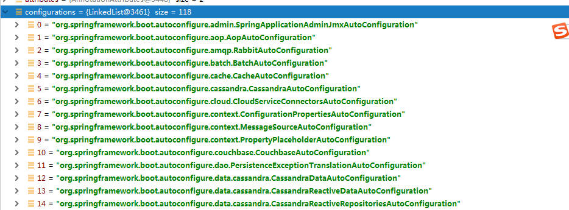
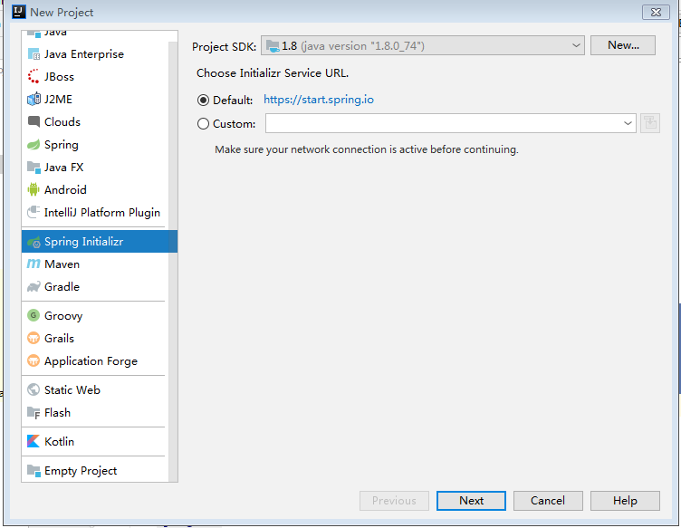

## 一、SpringBoot入门

### 1.SpringBoot概述

Spring Boot是由Pivotal团队提供的全新框架，其设计目的是用来**简化新Spring应用的初始搭建以及开发过程**。约定大于配置

### 2.SpringBoot特点

1. 创建独立的Spring应用程序

2. 嵌入的Tomcat，无需部署WAR文件

3. 简化Maven配置

4. 自动配置Spring

5. 提供生产就绪型功能，如指标，健康检查和外部配置

6. 绝对没有代码生成并且对XML也没有配置要求 

### 3.环境要求

- A favorite text editor or IDE
- [JDK 1.8](http://www.oracle.com/technetwork/java/javase/downloads/index.html) or later
- [Gradle 4+](http://www.gradle.org/downloads) or [Maven 3.2+](https://maven.apache.org/download.cgi)
- You can also import the code straight into your IDE:
  - [Spring Tool Suite (STS)](https://spring.io/guides/gs/sts)
  - [IntelliJ IDEA](https://spring.io/guides/gs/intellij-idea/)

### 4.SpringBoot创建HelloWorld入门案例

> 1.创建maven工程，指定打包方式为jar包

> 2.在pom.xml中配置父工程以及添加依赖

```xml
<!--配置父工程-->
    <parent>
        <groupId>org.springframework.boot</groupId>
        <artifactId>spring-boot-starter-parent</artifactId>
        <version>2.1.4.RELEASE</version>
    </parent>


    <dependencies>
        <!--添加web启动器依赖-->
        <dependency>
            <groupId>org.springframework.boot</groupId>
            <artifactId>spring-boot-starter-web</artifactId>
        </dependency>
    </dependencies>
```


> 3.创建Controller编写处理器

```java
@Controller
public class UserController {

    @RequestMapping("/sayHello")
    @ResponseBody
    public String sayHello(){
        return "hello world";
    }
}
```


> 4.创建SpringBoot主程序类

```java
/**
 * @SpringBootApplication 声明该类是一个SpringBoot主程序类，启动SpringBoot应用，只需要执行主程序类main方法即可
 */
@SpringBootApplication
public class MySpringBootApplication {
    public static void main(String[] args) {
        //启动SpringBoot应用
        SpringApplication.run(MySpringBootApplication.class,args);
    }
}

```

> 5.执行SpringBoot主程序类的main方法，启动SpringBoot应用

> 6.测试 http://localhost:8086/sayHello

### 5.SpringBoot可执行jar包打包

> 1.添加可执行jar包的插件

```xml
<build>
        <plugins>
            <!--创建可执行jar包插件-->
            <plugin>
                <groupId>org.springframework.boot</groupId>
                <artifactId>spring-boot-maven-plugin</artifactId>
            </plugin>
        </plugins>
    </build>
```

> 2.通过maven的package指令进行打包

> 3.执行该jar包 java -jar xxx.jar


### 6.分析HelloWorld入门案例

####   6.1 pom.xml分析

   ```xml
<!--配置父工程-->
    <parent>
        <groupId>org.springframework.boot</groupId>
        <artifactId>spring-boot-starter-parent</artifactId>
        <version>2.1.4.RELEASE</version>
    </parent>


    <dependencies>
        <!--添加web启动器依赖-->
        <dependency>
            <groupId>org.springframework.boot</groupId>
            <artifactId>spring-boot-starter-web</artifactId>
        </dependency>
    </dependencies>
   ```

> 6.1.1 父工程

```xml
<!--配置父工程：版本的仲裁中心-->
    <parent>
        <groupId>org.springframework.boot</groupId>
        <artifactId>spring-boot-starter-parent</artifactId>
        <version>2.1.4.RELEASE</version>
    </parent>

<!-- 父工程的父工程-->
<parent>
<groupId>org.springframework.boot</groupId>
<artifactId>spring-boot-dependencies</artifactId>
<version>2.1.4.RELEASE</version>
<relativePath>../../spring-boot-dependencies</relativePath>
</parent>
```

作用：对开发过程中常见的依赖的版本进行锁定，这样的话，我们在项目开发过程中添加依赖的时候，就可以不需要指定版本号了。（但是注意，对于版本仲裁中心中没有锁定的依赖，还需要手动添加版本号，比如：druid）

> 6.1.2 spring-boot-starter-web

spring-boot-starter-web:web的启动器，提供了web开发相关的所有的依赖

springboot启动器：spring-boot-starter-xxx

总结：springboot对我们日常开发的所有场景都进行了封装，封装成了若干个启动器，如果我们在开发过程中，需要使用什么场景，那么就添加什么场景的启动器。

 ####  6.2 主程序类分析

```java
/**
 * @SpringBootApplication 声明该类是一个SpringBoot主程序类，启动SpringBoot应用，只需要执行主程序类main方法即可
 */
@SpringBootApplication
public class MySpringBootApplication {
    public static void main(String[] args) {
        //启动SpringBoot应用
        SpringApplication.run(MySpringBootApplication.class,args);
    }
}
```

```java
(1)@SpringBootConfiguration
   SpringBoot的配置类
   	   @Configuration  Spring的配置类
   配置类<===>配置文件（applicationContext.xml  配置 bean）
   
   <beans>
   		<bean id="" class=""></bean>
        ...
   </beans>
   SpringBoot不推荐使用配置文件，推荐使用配置类
```


```java
(2)@EnableAutoConfiguration  开启自动配置
	 @AutoConfigurationPackage 自动配置导包
	 	@Import({Registrar.class})  向容器中注册组件？
	 获取SpringBootApplication注解所修饰的主程序类所在包，将该包（com.igeekhome.springboot_qs）下的所有组件注册到容器中
	 @Import({AutoConfigurationImportSelector.class}) 向容器中注册组件
	 SpringBoot在启动的时候给我们注册了很多自动配置包（所以很多配置都不需要我们自己配置）
	 
	 SpringFactoriesLoader.loadFactoryNames(EnableAutoConfiguration.class, META-INF/spring.factories);
```




### 7.Spring Initializr快速创建SpringBoot应用



**前提：保证网络环境**

在创建的项目的时候，可以选择需要的模块，创建完成之后，会默认指定父工程并且自动添加相关的启动器，并且自动创建SpringBoot的主程序类，只需要直接编写业务即可。

默认创建的工程，resources资源目录下：

application.properties  SpringBoot的默认的配置文件格式，可以在该文件中修改springboot的一些默认配置

static： 静态资源目录 （js css image...）

templates:  模板目录（SpringBoot应用默认内嵌了tomcat，无法解析jsp页面的，一般情况下选择springboot默认推荐的模板引擎：thymeleaf、freemarker）

## 二、SpringBoot的配置文件

SpringBoot在创建项目的时候，给我加载了很多自动配置，可以通过配置文件来修改SpringBoot的默认盘【配置

默认两种格式的配置文件：

application.properties

application.yaml


### 1.YAML简介

数据格式，以数据作为中心，所以该文件更适合做配置文件（比json xml）

常见：xml

<server>

​	<port>8086</port>

</server>


```yaml
server:
	port: 8086
```


### 2.YAML语法

YAML以键值对来描述数据：键:(空格)值  **空格是一定不能省略**

是以空格（而不是tab）来控制数据的层级关系，只要是左对齐的一列数据，都是同一级别的

键、值都是大小写敏感的


#### 2.1.值的写法

> （1）字面量（字符串）

直接在值的位置配置属性值即可，默认是字符串，不需要添加双引号

> （2）对象（Map）

```yaml
employee01:
  name: 张三
  age: 20
  dept:
    deptNo: 001
    deptName: 技术部
```

行内写法：

```yaml
employee01:
  name: 张三
  age: 20
  dept: {deptNo: 001,deptName: 技术部}
```

> （3）数组、集合

```yaml
employee01:
  name: 张三
  age: 20
  dept: {deptNo: 001,deptName: 技术部}
  subjects:
    - java
    - c#
    - go
```

行内写法

```yaml
employee01:
  name: 张三
  age: 20
  dept: {deptNo: 001,deptName: 技术部}
  subjects: [java,c,go]
```


### 3. YAML属性与对象属性的绑定

```java
/**
 * @author Administrator
 * @create 2019/06/03
 *
 * 如果需要使用@ConfigurationProperties 那么前提是：当前对象必须是spring容器中的组件
 *
 * @ConfigurationProperties:将配置文件中的配置属性与对象中的属性进行关联
 * prefix:指定将配置文件中的哪个配置进行关联
 */
@Component
@ConfigurationProperties(prefix = "employee01")
public class Employee {
    private String name;
    private Integer age;
    private Dept dept;
    private String[] subjects;
```


添加依赖，让在编写配置文件的时候能够有提示

```
<!--SpringBoot 配置处理器 能够在编写配置文件的时候出现提示-->
<dependency>
    <groupId>org.springframework.boot</groupId>
    <artifactId>spring-boot-configuration-processor</artifactId>
    <optional>true</optional>
</dependency>
```

### 4.@ConfigurationProperties VS @Value

| 对比            | @ConfigurationProperties | @Value       |
| --------------- | ------------------------ | ------------ |
| 功能            | 批量绑定属性             | 单个属性绑定 |
| 松散耦合绑定    | 支持                     | 不支持       |
| SPEL表达式      | 不支持                   | 支持         |
| 复杂对象        | 支持                     | 不支持       |
| JSR303 数据校验 | 支持                     | 不支持       |

### 5.加载外部属性配置文件

```prope
employee01.username=张三
employee01.age=20
employee01.dept.deptNo=002
employee01.dept.deptName=市场部
employee01.subjects=[java,c,go]
```

```java
/**
 * @author Administrator
 * @create 2019/06/03
 *
 * 如果需要使用@ConfigurationProperties 那么前提是：当前对象必须是spring容器中的组件
 *
 * @ConfigurationProperties:将配置文件中的配置属性与对象中的属性进行关联
 * prefix:指定将配置文件中的哪个配置进行关联
 *
 * @PropertySource:指定从哪个外部文件中加载配置(注意：@PropertySource加载外部文件，则文件类型必须是properties而不能是yaml文件)
 */
@Component
@PropertySource(value = "classpath:employee.properties")
@ConfigurationProperties(prefix = "employee01")
//@Validated //开启数据校验功能
public class Employee {
```


### 6.SpringBoot加载Spring配置文件

SpringBoot推荐使用配置类来代替配置文件，所以SpringBoot应用在启动的时候不会加载Spring的配置文件，如果需要加载，则需要手动配置

> 1.编写spring配置文件

```xml
<?xml version="1.0" encoding="UTF-8"?>
<beans xmlns="http://www.springframework.org/schema/beans"
       xmlns:xsi="http://www.w3.org/2001/XMLSchema-instance"
       xsi:schemaLocation="http://www.springframework.org/schema/beans http://www.springframework.org/schema/beans/spring-beans.xsd">
    <bean id="userService" class="com.igeekhome.springboot_qs_02.service.UserService"></bean>
</beans>
```

> 2.通过@ImportResource 加载指定配置文件

```java
@SpringBootApplication
/*@ImportResource 加载spring配置文件*/
@ImportResource(locations = {"classpath:applicationContext.xml"})
public class SpringbootQs02Application {

    public static void main(String[] args) {
        SpringApplication.run(SpringbootQs02Application.class, args);
    }

}

```


## 三、SpringBoot Web开发

### 1.SpringBoot对静态资源如何处理的（js css image）

```java
public void addResourceHandlers(ResourceHandlerRegistry registry) {
            if (!this.resourceProperties.isAddMappings()) {
                logger.debug("Default resource handling disabled");
            } else {
                Duration cachePeriod = this.resourceProperties.getCache().getPeriod();
                CacheControl cacheControl = this.resourceProperties.getCache().getCachecontrol().toHttpCacheControl();
                if (!registry.hasMappingForPattern("/webjars/**")) {
                    this.customizeResourceHandlerRegistration(registry.addResourceHandler(new String[]{"/webjars/**"}).addResourceLocations(new String[]{"classpath:/META-INF/resources/webjars/"}).setCachePeriod(this.getSeconds(cachePeriod)).setCacheControl(cacheControl));
                }

                String staticPathPattern = this.mvcProperties.getStaticPathPattern();
                if (!registry.hasMappingForPattern(staticPathPattern)) {
                    this.customizeResourceHandlerRegistration(registry.addResourceHandler(new String[]{staticPathPattern}).addResourceLocations(getResourceLocations(this.resourceProperties.getStaticLocations())).setCachePeriod(this.getSeconds(cachePeriod)).setCacheControl(cacheControl));
                }

            }
        }
```


> 1.webjars 

以jar包的方式引入静态资源

```xml
<dependency>
            <groupId>org.webjars</groupId>
            <artifactId>jquery</artifactId>
            <version>3.4.1</version>
        </dependency>
```

http://localhost:8086/webjars/jquery/3.4.1/jquery.js


> 2.其他静态资源

对于  /**   到以下四个位置进行查找处理：

```
classpath:/META-INF/resources/
classpath:/resources/
classpath:/static/
classpath:/public/
```