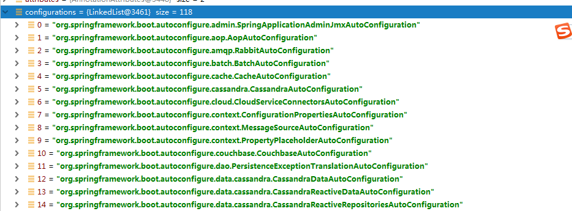
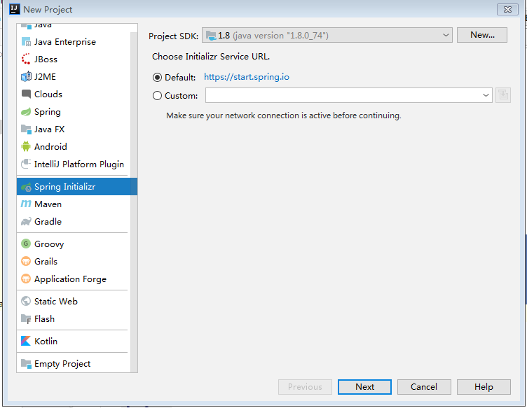

## 一、SpringBoot入门

### 1.SpringBoot概述

Spring Boot是由Pivotal团队提供的全新框架，其设计目的是用来**简化新Spring应用的初始搭建以及开发过程**。约定大于配置

### 2.SpringBoot特点

1. 创建独立的Spring应用程序

2. 嵌入的Tomcat，无需部署WAR文件

3. 简化Maven配置

4. 自动配置Spring

5. 提供生产就绪型功能，如指标，健康检查和外部配置

6. 绝对没有代码生成并且对XML也没有配置要求 

### 3.环境要求

- A favorite text editor or IDE
- [JDK 1.8](http://www.oracle.com/technetwork/java/javase/downloads/index.html) or later
- [Gradle 4+](http://www.gradle.org/downloads) or [Maven 3.2+](https://maven.apache.org/download.cgi)
- You can also import the code straight into your IDE:
  - [Spring Tool Suite (STS)](https://spring.io/guides/gs/sts)
  - [IntelliJ IDEA](https://spring.io/guides/gs/intellij-idea/)

### 4.SpringBoot创建HelloWorld入门案例

> 1.创建maven工程，指定打包方式为jar包

> 2.在pom.xml中配置父工程以及添加依赖

```xml
<!--配置父工程-->
    <parent>
        <groupId>org.springframework.boot</groupId>
        <artifactId>spring-boot-starter-parent</artifactId>
        <version>2.1.4.RELEASE</version>
    </parent>


    <dependencies>
        <!--添加web启动器依赖-->
        <dependency>
            <groupId>org.springframework.boot</groupId>
            <artifactId>spring-boot-starter-web</artifactId>
        </dependency>
    </dependencies>
```


> 3.创建Controller编写处理器

```java
@Controller
public class UserController {

    @RequestMapping("/sayHello")
    @ResponseBody
    public String sayHello(){
        return "hello world";
    }
}
```


> 4.创建SpringBoot主程序类

```java
/**
 * @SpringBootApplication 声明该类是一个SpringBoot主程序类，启动SpringBoot应用，只需要执行主程序类main方法即可
 */
@SpringBootApplication
public class MySpringBootApplication {
    public static void main(String[] args) {
        //启动SpringBoot应用
        SpringApplication.run(MySpringBootApplication.class,args);
    }
}

```

> 5.执行SpringBoot主程序类的main方法，启动SpringBoot应用

> 6.测试 http://localhost:8086/sayHello

### 5.SpringBoot可执行jar包打包

> 1.添加可执行jar包的插件

```xml
<build>
        <plugins>
            <!--创建可执行jar包插件-->
            <plugin>
                <groupId>org.springframework.boot</groupId>
                <artifactId>spring-boot-maven-plugin</artifactId>
            </plugin>
        </plugins>
    </build>
```

> 2.通过maven的package指令进行打包

> 3.执行该jar包 java -jar xxx.jar


### 6.分析HelloWorld入门案例

####   6.1 pom.xml分析

   ```xml
<!--配置父工程-->
    <parent>
        <groupId>org.springframework.boot</groupId>
        <artifactId>spring-boot-starter-parent</artifactId>
        <version>2.1.4.RELEASE</version>
    </parent>


    <dependencies>
        <!--添加web启动器依赖-->
        <dependency>
            <groupId>org.springframework.boot</groupId>
            <artifactId>spring-boot-starter-web</artifactId>
        </dependency>
    </dependencies>
   ```

> 6.1.1 父工程

```xml
<!--配置父工程：版本的仲裁中心-->
    <parent>
        <groupId>org.springframework.boot</groupId>
        <artifactId>spring-boot-starter-parent</artifactId>
        <version>2.1.4.RELEASE</version>
    </parent>

<!-- 父工程的父工程-->
<parent>
<groupId>org.springframework.boot</groupId>
<artifactId>spring-boot-dependencies</artifactId>
<version>2.1.4.RELEASE</version>
<relativePath>../../spring-boot-dependencies</relativePath>
</parent>
```

作用：对开发过程中常见的依赖的版本进行锁定，这样的话，我们在项目开发过程中添加依赖的时候，就可以不需要指定版本号了。（但是注意，对于版本仲裁中心中没有锁定的依赖，还需要手动添加版本号，比如：druid）

> 6.1.2 spring-boot-starter-web

spring-boot-starter-web:web的启动器，提供了web开发相关的所有的依赖

springboot启动器：spring-boot-starter-xxx

总结：springboot对我们日常开发的所有场景都进行了封装，封装成了若干个启动器，如果我们在开发过程中，需要使用什么场景，那么就添加什么场景的启动器。

 ####  6.2 主程序类分析

```java
/**
 * @SpringBootApplication 声明该类是一个SpringBoot主程序类，启动SpringBoot应用，只需要执行主程序类main方法即可
 */
@SpringBootApplication
public class MySpringBootApplication {
    public static void main(String[] args) {
        //启动SpringBoot应用
        SpringApplication.run(MySpringBootApplication.class,args);
    }
}
```

```java
(1)@SpringBootConfiguration
   SpringBoot的配置类
   	   @Configuration  Spring的配置类
   配置类<===>配置文件（applicationContext.xml  配置 bean）
   
   <beans>
   		<bean id="" class=""></bean>
        ...
   </beans>
   SpringBoot不推荐使用配置文件，推荐使用配置类
```


```java
(2)@EnableAutoConfiguration  开启自动配置
	 @AutoConfigurationPackage 自动配置导包
	 	@Import({Registrar.class})  向容器中注册组件？
	 获取SpringBootApplication注解所修饰的主程序类所在包，将该包（com.igeekhome.springboot_qs）下的所有组件注册到容器中
	 @Import({AutoConfigurationImportSelector.class}) 向容器中注册组件
	 SpringBoot在启动的时候给我们注册了很多自动配置包（所以很多配置都不需要我们自己配置）
	 
	 SpringFactoriesLoader.loadFactoryNames(EnableAutoConfiguration.class, META-INF/spring.factories);
```




### 7.Spring Initializr快速创建SpringBoot应用



**前提：保证网络环境**

在创建的项目的时候，可以选择需要的模块，创建完成之后，会默认指定父工程并且自动添加相关的启动器，并且自动创建SpringBoot的主程序类，只需要直接编写业务即可。

默认创建的工程，resources资源目录下：

application.properties  SpringBoot的默认的配置文件格式，可以在该文件中修改springboot的一些默认配置

static： 静态资源目录 （js css image...）

templates:  模板目录（SpringBoot应用默认内嵌了tomcat，无法解析jsp页面的，一般情况下选择springboot默认推荐的模板引擎：thymeleaf、freemarker）

## 二、SpringBoot的配置文件

SpringBoot在创建项目的时候，给我加载了很多自动配置，可以通过配置文件来修改SpringBoot的默认盘【配置

默认两种格式的配置文件：

application.properties

application.yaml


### 1.YAML简介

数据格式，以数据作为中心，所以该文件更适合做配置文件（比json xml）

常见：xml

<server>

​	<port>8086</port>

</server>


```yaml
server:
	port: 8086
```


### 2.YAML语法

YAML以键值对来描述数据：键:(空格)值  **空格是一定不能省略**

是以空格（而不是tab）来控制数据的层级关系，只要是左对齐的一列数据，都是同一级别的

键、值都是大小写敏感的


#### 2.1.值的写法

> （1）字面量（字符串）

直接在值的位置配置属性值即可，默认是字符串，不需要添加双引号

> （2）对象（Map）

```yaml
employee01:
  name: 张三
  age: 20
  dept:
    deptNo: 001
    deptName: 技术部
```

行内写法：

```yaml
employee01:
  name: 张三
  age: 20
  dept: {deptNo: 001,deptName: 技术部}
```

> （3）数组、集合

```yaml
employee01:
  name: 张三
  age: 20
  dept: {deptNo: 001,deptName: 技术部}
  subjects:
    - java
    - c#
    - go
```

行内写法

```yaml
employee01:
  name: 张三
  age: 20
  dept: {deptNo: 001,deptName: 技术部}
  subjects: [java,c,go]
```


### 3. YAML属性与对象属性的绑定

```java
/**
 * @author Administrator
 * @create 2019/06/03
 *
 * 如果需要使用@ConfigurationProperties 那么前提是：当前对象必须是spring容器中的组件
 *
 * @ConfigurationProperties:将配置文件中的配置属性与对象中的属性进行关联
 * prefix:指定将配置文件中的哪个配置进行关联
 */
@Component
@ConfigurationProperties(prefix = "employee01")
public class Employee {
    private String name;
    private Integer age;
    private Dept dept;
    private String[] subjects;
```


添加依赖，让在编写配置文件的时候能够有提示

```
<!--SpringBoot 配置处理器 能够在编写配置文件的时候出现提示-->
<dependency>
    <groupId>org.springframework.boot</groupId>
    <artifactId>spring-boot-configuration-processor</artifactId>
    <optional>true</optional>
</dependency>
```

### 4.@ConfigurationProperties VS @Value

| 对比            | @ConfigurationProperties | @Value       |
| --------------- | ------------------------ | ------------ |
| 功能            | 批量绑定属性             | 单个属性绑定 |
| 松散耦合绑定    | 支持                     | 不支持       |
| SPEL表达式      | 不支持                   | 支持         |
| 复杂对象        | 支持                     | 不支持       |
| JSR303 数据校验 | 支持                     | 不支持       |

### 5.加载外部属性配置文件

```prope
employee01.username=张三
employee01.age=20
employee01.dept.deptNo=002
employee01.dept.deptName=市场部
employee01.subjects=[java,c,go]
```

```java
/**
 * @author Administrator
 * @create 2019/06/03
 *
 * 如果需要使用@ConfigurationProperties 那么前提是：当前对象必须是spring容器中的组件
 *
 * @ConfigurationProperties:将配置文件中的配置属性与对象中的属性进行关联
 * prefix:指定将配置文件中的哪个配置进行关联
 *
 * @PropertySource:指定从哪个外部文件中加载配置(注意：@PropertySource加载外部文件，则文件类型必须是properties而不能是yaml文件)
 */
@Component
@PropertySource(value = "classpath:employee.properties")
@ConfigurationProperties(prefix = "employee01")
//@Validated //开启数据校验功能
public class Employee {
```


### 6.SpringBoot加载Spring配置文件

SpringBoot推荐使用配置类来代替配置文件，所以SpringBoot应用在启动的时候不会加载Spring的配置文件，如果需要加载，则需要手动配置

> 1.编写spring配置文件

```xml
<?xml version="1.0" encoding="UTF-8"?>
<beans xmlns="http://www.springframework.org/schema/beans"
       xmlns:xsi="http://www.w3.org/2001/XMLSchema-instance"
       xsi:schemaLocation="http://www.springframework.org/schema/beans http://www.springframework.org/schema/beans/spring-beans.xsd">
    <bean id="userService" class="com.igeekhome.springboot_qs_02.service.UserService"></bean>
</beans>
```

> 2.通过@ImportResource 加载指定配置文件

```java
@SpringBootApplication
/*@ImportResource 加载spring配置文件*/
@ImportResource(locations = {"classpath:applicationContext.xml"})
public class SpringbootQs02Application {

    public static void main(String[] args) {
        SpringApplication.run(SpringbootQs02Application.class, args);
    }

}

```


## 三、SpringBoot Web开发

### 1.SpringBoot对静态资源如何处理的（js css image）

```java
public void addResourceHandlers(ResourceHandlerRegistry registry) {
            if (!this.resourceProperties.isAddMappings()) {
                logger.debug("Default resource handling disabled");
            } else {
                Duration cachePeriod = this.resourceProperties.getCache().getPeriod();
                CacheControl cacheControl = this.resourceProperties.getCache().getCachecontrol().toHttpCacheControl();
                if (!registry.hasMappingForPattern("/webjars/**")) {
                    this.customizeResourceHandlerRegistration(registry.addResourceHandler(new String[]{"/webjars/**"}).addResourceLocations(new String[]{"classpath:/META-INF/resources/webjars/"}).setCachePeriod(this.getSeconds(cachePeriod)).setCacheControl(cacheControl));
                }

                String staticPathPattern = this.mvcProperties.getStaticPathPattern();
                if (!registry.hasMappingForPattern(staticPathPattern)) {
                    this.customizeResourceHandlerRegistration(registry.addResourceHandler(new String[]{staticPathPattern}).addResourceLocations(getResourceLocations(this.resourceProperties.getStaticLocations())).setCachePeriod(this.getSeconds(cachePeriod)).setCacheControl(cacheControl));
                }

            }
        }
```


> 1.webjars 

以jar包的方式引入静态资源

```xml
<dependency>
            <groupId>org.webjars</groupId>
            <artifactId>jquery</artifactId>
            <version>3.4.1</version>
        </dependency>
```

http://localhost:8086/webjars/jquery/3.4.1/jquery.js


> 2.其他静态资源

对于  /**   到以下四个位置进行查找处理：

```
classpath:/META-INF/resources/
classpath:/resources/
classpath:/static/
classpath:/public/
```

### 2.模板引擎Thymeleaf


#### 2.1 如何引入ThymeLeaf

```pom
<!--添加thymeleaf启动器-->
        <dependency>
            <groupId>org.springframework.boot</groupId>
            <artifactId>spring-boot-starter-thymeleaf</artifactId>
        </dependency>
```


默认模板位置 classpath:/templates/


可以在springboot配置文件中修改这些属性

```xml
# 修改thymeleaf模板位置
# spring.thymeleaf.prefix=
# spring.thymeleaf.suffix=
```


在html模板中如果需要出现thymeleaf提示，需要声明命名空间

> 1.属性操作

```html
<p th:text="${text}" th:id="${test_id}" th:class="${test_class}" id="myid" class="myclass">默认内容</p>
```

th 可以操作元素的任意属性


> 2.表达式

变量表达式： **${...}**


> 3.常规操作

（1）取值  ${}

```java
@RequestMapping("/user")
    public String user(Model model){
        User user = new User("001","张三",0,"江苏无锡");
        model.addAttribute("user",user);
        return "user";
    }
```


```html
用户ID:<p th:text="${user.id}"></p>
用户姓名:<p th:text="${user.name}"></p>
用户性别：<p th:text="${user.sex}"></p>
用户地址:[[${user.address}]]  <!--行内写法-->
```


（2）条件判断

```html
用户性别：
<p th:if="${user.sex == 0}">男</p>
<p th:if="${user.sex == 1}">女</p>
```


（3）内置对象

- `#ctx`: the context object.
- `#vars:` the context variables.
- `#locale`: the context locale.
- `#request`: (only in Web Contexts) the `HttpServletRequest` object.
- `#response`: (only in Web Contexts) the `HttpServletResponse` object.
- `#session`: (only in Web Contexts) the `HttpSession` object.
- `#servletContext`: (only in Web Contexts) the `ServletContext` object.

```html
当前系统用户：[[${session.username}]]
```


（4）工具对象

- `#execInfo`: information about the template being processed.
- `#messages`: methods for obtaining externalized messages inside variables expressions, in the same way as they would be obtained using #{…} syntax.
- `#uris`: methods for escaping parts of URLs/URIs
- `#conversions`: methods for executing the configured *conversion service* (if any).
- `#dates`: methods for `java.util.Date` objects: formatting, component extraction, etc.
- `#calendars`: analogous to `#dates`, but for `java.util.Calendar` objects.
- `#numbers`: methods for formatting numeric objects.
- `#strings`: methods for `String` objects: contains, startsWith, prepending/appending, etc.
- `#objects`: methods for objects in general.
- `#bools`: methods for boolean evaluation.
- `#arrays`: methods for arrays.
- `#lists`: methods for lists.
- `#sets`: methods for sets.
- `#maps`: methods for maps.
- `#aggregates`: methods for creating aggregates on arrays or collections.
- `#ids`: methods for dealing with id attributes that might be repeated (for example, as a result of an iteration).

```html
用户生日:<p th:text="${#dates.format(user.birthday, 'yyyy/MM/dd')}"></p>
```


（5）遍历

```html
<table>
    <tr>
        <th>编号</th>
        <th>姓名</th>
        <th>性别</th>
        <th>生日</th>
        <th>地址</th>
    </tr>

    <tr th:each="u : ${users}">
        <td>[[${u.id}]]</td>
        <td>[[${u.name}]]</td>
        <td th:if="${u.sex==0}">
            男
        </td>
        <td th:if="${u.sex==1}">
            女
        </td>
        <td th:text="${#dates.format(u.birthday,'yyyy-MM-dd')}"></td>
        <td>[[${u.address}]]</td>
    </tr>
</table>
```

###　3.SpringBoot对错误页面处理

SpringBoot应用在启动时，会加载很多自动配置（118）

```java
ErrorMvcAutoConfiguration 对页面错误处理的自动配置

加载了以下几个重要的组件：
DefaultErrorAttributes  错误处理的属性
public Map<String, Object> getErrorAttributes(WebRequest webRequest, boolean includeStackTrace) {
        Map<String, Object> errorAttributes = new LinkedHashMap();
        errorAttributes.put("timestamp", new Date());
        this.addStatus(errorAttributes, webRequest);
        this.addErrorDetails(errorAttributes, webRequest, includeStackTrace);
        this.addPath(errorAttributes, webRequest);
        return errorAttributes;
    }
    
BasicErrorController  基础的错误处理器

ErrorPageCustomizer  错误页面的定制组件

DefaultErrorViewResolver 默认错误处理视图解析器

首先当系统出现4xx、5xx异常状态码时，会通过ErrorPageCustomizer组件，定制错误处理的路径、请求
@Value("${error.path:/error}")
    private String path = "/error";

public void registerErrorPages(ErrorPageRegistry errorPageRegistry) {

			//错误页面的路径  /error
            ErrorPage errorPage = new ErrorPage(this.dispatcherServletPath.getRelativePath(this.properties.getError().getPath()));
            errorPageRegistry.addErrorPages(new ErrorPage[]{errorPage});
        }

发出 /error请求，由BasicErrorController 处理处理器对错误进行处理
RequestMapping(
        produces = {"text/html"}   //用于返回text/html类型的数据
    )
    public ModelAndView errorHtml(HttpServletRequest request, HttpServletResponse response) {
        HttpStatus status = this.getStatus(request);
        Map<String, Object> model = Collections.unmodifiableMap(this.getErrorAttributes(request, this.isIncludeStackTrace(request, MediaType.TEXT_HTML)));
        response.setStatus(status.value());
        ModelAndView modelAndView = this.resolveErrorView(request, response, status, model);
        return modelAndView != null ? modelAndView : new ModelAndView("error", model);
    }

    @RequestMapping   //返回JSON数据
    public ResponseEntity<Map<String, Object>> error(HttpServletRequest request) {
        Map<String, Object> body = this.getErrorAttributes(request, this.isIncludeStackTrace(request, MediaType.ALL));
        HttpStatus status = this.getStatus(request);
        return new ResponseEntity(body, status);
    }

如果是客户端请求（IOS、Android）返回JSON数据
如果是浏览器请求，就返回ModelAndView？

this.resolveErrorView(request, response, status, model);通过错误视图解析器解析错误页面视图
底层调用： resolver.resolveErrorView(request, status, model);
resolver=>DefaultErrorViewResolver?如何对错误页面解析的

public ModelAndView resolveErrorView(HttpServletRequest request, HttpStatus status, Map<String, Object> model) {
        ModelAndView modelAndView = this.resolve(String.valueOf(status.value()), model);
        if (modelAndView == null && SERIES_VIEWS.containsKey(status.series())) {
            modelAndView = this.resolve((String)SERIES_VIEWS.get(status.series()), model);
        }

        return modelAndView;
    }

	//viewName => 状态码 404 500
    private ModelAndView resolve(String viewName, Map<String, Object> model) {
    	//在error目录下查找以状态码命名的文件
        String errorViewName = "error/" + viewName;
        //可用的模板引擎容器（判断当前是否有模板引擎）
        TemplateAvailabilityProvider provider = this.templateAvailabilityProviders.getProvider(errorViewName, this.applicationContext);
        return provider != null ? new ModelAndView(errorViewName, model) : 
        //如果有模板引擎  直接发起 error/404   => /templates/+ error/404 + .html
        
        this.resolveResource(errorViewName, model);
        //如有没有模板引擎
        //在静态资源目录查找error/404.html
    }

```


> 自定义错误处理页面

总结：

如果存在模板引擎，则错误页面放在 templates/error/

如有没有模板引擎，则错误页面放在 static/error/

错误页面的命名方式：以状态码进行命名

404.html 500.html

也支持通配符 比如，4xx的状态码 可以指定 4xx.html

  5xx.html 来对5xx的状态码进行处理

支持优先匹配原则，如果存在404.html、4xx.html ,那么如果404的状态码则优先匹配404.html


> 获取错误属性

DefaultErrorAttributes 包含以下属性


```html
时间：
<p th:text="${timestamp}"></p>
状态码:
<p th:text="${status}"></p>
消息:
<p th:text="${message}"></p>
```

### 4.SpringBoot Servlet三大组件、以及拦截器注册

如果需要配置三大组件（Servlet、Filter、Listener）通过以下三个组件进行注册操作

```
ServletRegistrationBean, FilterRegistrationBean, ServletListenerRegistrationBean
```

> 1 注册Servlet

```java
在配置类中添加以下配置

/*注册Servlet*/
    @Bean
    public ServletRegistrationBean servletRegistrationBean(){
        ServletRegistrationBean servletRegistrationBean = new ServletRegistrationBean(new MyServlet(),"/myServlet");
        return servletRegistrationBean;
    }
```

> 2.注册Filter

```java
 /* 注册Filter*/
    @Bean
    public FilterRegistrationBean filterRegistrationBean(){
        FilterRegistrationBean filterRegistrationBean = new FilterRegistrationBean();
        filterRegistrationBean.setFilter(new MyFilter());//设置过滤器
        //添加过滤路径
        filterRegistrationBean.addUrlPatterns("/myServlet","/user");
        return filterRegistrationBean;
    }
```

> 3.注册Listener

```java
 /*注册Listener*/
    @Bean
    public ServletListenerRegistrationBean servletListenerRegistrationBean(){
        ServletListenerRegistrationBean servletListenerRegistrationBean = new ServletListenerRegistrationBean();
        servletListenerRegistrationBean.setListener(new MyListener());//设置监听器
        return servletListenerRegistrationBean;
    }
```

> 4. 拦截器配置

If you want to keep Spring Boot MVC features and you want to add additional [MVC configuration](https://docs.spring.io/spring/docs/5.1.7.RELEASE/spring-framework-reference/web.html#mvc) (interceptors, formatters, view controllers, and other features), you can add your own `@Configuration` class of type `WebMvcConfigurer` but **without** `@EnableWebMvc`.


如果需要在springboot中配置拦截器，只需要添加一个配置类（@Configuration），并且这个配置类需要实现WebMvcConfigurer接口即可

```java
@Configuration
public class MyConfiguration implements WebMvcConfigurer {
    /**
     * 添加拦截器
     * @param registry
     */
    @Override
    public void addInterceptors(InterceptorRegistry registry) {
        //配置自定义拦截器 指定该拦截器的拦截路径
        registry.addInterceptor(new MyInteceptor()).addPathPatterns("/list");
        //..如果有其他拦截器 继续add

    }
}
```


### 5.SpringBoot配置外嵌Tomcat以及对Jsp支持

通过Spring Initializr创建SpringBoot应用时指定打包方式为war包，并且添加web.xml文件即可。


## 四、SpringBoot持久层操作

### 1.SpringBoot与JDBC整合

>  1.需要在创建项目的时候，添加MySQL模块、JDBC模块

>  2.如果MySQL数据库版本比较低，需要重新指定MySQL驱动版本

>  3.在springboot配置文件中，修改连接属性

```properties
# 配置数据库连接
spring.datasource.url=jdbc:mysql://localhost:3306/egoubuy?characterEncoding=utf-8
spring.datasource.username=root
spring.datasource.password=root
spring.datasource.driver-class-name=com.mysql.jdbc.Driver
```


### 2.SpringBoot整合Druid连接池

> 1.添加druid依赖

> 2.在配置文件中，指定数据源类型

```properties
# 指定数据源类型（springboot默认数据源HikariDataSource）
spring.datasource.type=com.alibaba.druid.pool.DruidDataSource

# 设置druid数据源特定属性
spring.datasource.initialSize=10
spring.datasource.maxActive=20
spring.datasource.maxIdle=10
spring.datasource.minIdle=5
```

>  3.通过自定义配置类，配置DruidDataSource

```java
@Configuration
public class MyDataSourceConfiguration {

    @Bean
    @ConfigurationProperties(prefix = "spring.datasource")//指定spring.datasource中的配置与DruidDatasource中的属性一一绑定
    public DruidDataSource druidDataSource(){
        return new DruidDataSource();
    }
}
```


### 3.SpringBoot与MyBatis整合

#### 3.1 注解版本开发

>1.需要在创建项目的时候，添加MySQL模块、JDBC模块、MyBatis模块

>  2.如果MySQL数据库版本比较低，需要重新指定MySQL驱动版本

> 3.配置Druid数据源

> 4.编写Mapper接口，并添加@Mapper注解（声明该接口是一个Mapper接口）

```java
@Mapper  //声明当前接口是一个Mapper接口
public interface UserMapper {
    @Select("select id,username,phone,email,created,updated from tb_user")
    public List<User> list();

    @Insert("insert into tb_user(username,password,phone,email,created,updated) values(#{username},#{password},#{phone},#{email},#{created},#{updated})")
    public boolean add(User user);

    @Update("update tb_user set username=#{username},password=#{password},phone=#{phone},email=#{email},created=#{created},updated=#{updated} where id = #{id}")
    public boolean update(User user);

    @Delete("delete from tb_user where id = #{id}")
    public boolean delete(Long id);
}
```

> 5. 在主程序类上添加 @MapperScan注解

```java
@MapperScan(basePackages = "com.igeekhome.springboot_mybatis.mapper")  //指定从哪个包下扫描mapper接口
```


#### 3.2 基于配置文件版本开发

> 1.需要在创建项目的时候，添加MySQL模块、JDBC模块、MyBatis模块

>  2.如果MySQL数据库版本比较低，需要重新指定MySQL驱动版本

> 3.配置Druid数据源

> 4.编写Mapper接口

> 5.编写Mapper映射文件

```xml
<?xml version="1.0" encoding="UTF-8" ?>
<!DOCTYPE mapper
        PUBLIC "-//mybatis.org//DTD Mapper 3.0//EN"
        "http://mybatis.org/dtd/mybatis-3-mapper.dtd">
<mapper namespace="com.igeekhome.springboot_mybatis.mapper.UserMapper">
    <select id="list" resultType="com.igeekhome.springboot_mybatis.pojo.User">
        select id,username,phone,email,created,updated from tb_user
    </select>

    <!--
    ...
    -->
</mapper>
```

> 6.添加mybatis全局配置文件

> 7.在springboot配置文件中指定mybatis配置文件路径以及映射文件路径

```properties
# 配置mybatis配置文件以及映射文件路径
mybatis.config-location=classpath:mybatis/sqlMapConfig.xml
mybatis.mapper-locations=classpath:mybatis/mapper
```

