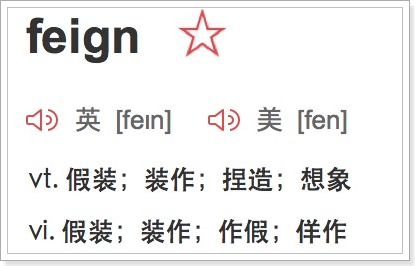
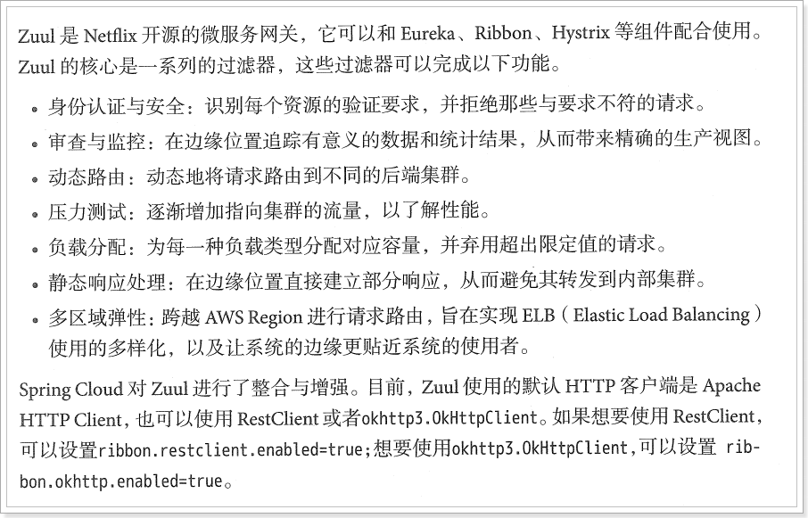
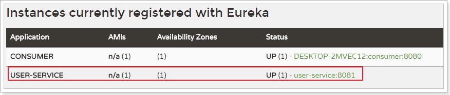

# 0.学习目标

- 会配置Hystix熔断
- 会使用Feign进行远程调用
- 能独立搭建Zuul网关
- 能编写Zuul的拦截器


# 1.Hystix

## 1.1.简介

Hystix，即熔断器。

主页：https://github.com/Netflix/Hystrix/


那么Hystix的作用是什么呢？具体要保护什么呢？

Hystix是Netflix开源的一个延迟和容错库，用于隔离访问远程服务、第三方库，防止出现级联失败。

## 1.2.雪崩问题

微服务中，服务间调用关系错综复杂，一个请求有可能调用多个微服务接口才可以实现，会形成非常复杂的调用链路：


如图，一次业务请求，需要调用A、P、H、I四个服务，这四个服务又可能调用其他服务，如果此时某个服务出现异常


例如微服务I发生异常，请求阻塞，用户不会得到响应，则tomcat这个线程不会释放，于是越来越多的用户请求到来，越来越多的线程会阻塞；


服务器支持的线程和并发数有限，请求一直阻塞，会导致服务器资源耗尽，从而导致所有其他服务都不可用，形成雪崩效应。

这就好比，一个汽车生产线，生产不同的汽车，需要使用不同的零件，如果某个零件因为种种原因无法使用，那么就会造成整台车无法装配，陷入等待零件的状态，直到零件到位，才能继续组装，此时如果有很多个车型都需要这个零件，那么整个工厂都将陷入等待状态，导致所有生产都陷入瘫痪，一个零件的坡及范围不断扩大。

Hystix解决雪崩问题的手段有两个：

- 线程隔离

- 服务熔断

## 1.3.线程隔离，服务降级

### 1.3.1原理

线程隔离示意图：


解读：

​       Hystrix为每个依赖服务调用分配一个小的线程池，如果线程池已满调用将被立即拒绝，默认不采用排队，加速失败判定时间。

用户的请求将不再直接访问服务，而是通过线程池中空闲的线程来访问服务，如果线程池已满，或者请求超时，则会进行降级处理，什么是服务降级？

服务降级：优先保护核心服务，而非核心服务不可用或弱可用。

用户请求故障时，不会被阻塞，更不会无休止的等待或者看到系统崩溃，至少可以看到一个执行结果（例如返回友好的提示信息）

服务降级虽然会导致请求失败，但是不会造成阻塞，而且最多会影响整个依赖服务对应的线程池中的资源，对其他服务没有响应。

触发Hystrix服务降级的条件：

- 线程池已满
- 请求超时

## 1.4.动手实践

### 1.4.1.引入依赖

首先在baoman_service_consumer中引入Hystix依赖：

```xml
<dependency>
    <groupId>org.springframework.cloud</groupId>
    <artifactId>spring-cloud-starter-netflix-hystrix</artifactId>
</dependency>
```

### 1.4.2.开启熔断

在启动类上添加@EnableCircuitBreaker注解

```java
@EnableCircuitBreaker
@SpringBootApplication
@EnableDiscoveryClient
public class ConsumerApplication {
.......
```


可以看到上面的注解越来越多，在微服务中经常会引入上面三个注解，于是SpringCloud给我们提供了一个组合注解@SpringCloudApplication


因此我们可以使用这个组合注解来代替前面的三个注解

```java
@SpringCloudApplication
public class ConsumerApplication {
    .......
}
```

### 1.4.3编写降级逻辑

当目标服务的调用出现故障，我们希望快速失败，给用户一个友好提示，因此需要提前编写好失败降级的处理逻辑，要使用@HystrixCommand来完成

```java
  @GetMapping("{id}")
    @HystrixCommand(fallbackMethod = "queryByIdFallback")
    public String queryById(@PathVariable("id")Long id) {
        String url = "http://user-service/user/"+id;
        String user = restTemplate.getForObject(url, String.class);
        return user;
    }
    public String queryByIdFallback(Long id) {
        return "网络开小差了，请稍后再试";
    }
```

要注意，因为熔断降级逻辑方法必须跟正常逻辑方法保证：相同的参数列表和返回值声明，失败逻辑中返回User对象没有太大意义，一般返回友好提示，所以吧queryById方法改为返回String，反正也是JSON数据，这样失败逻辑中返回一个错误说明会比较方便。

说明：

- @HystrixCommand(fallbackMethod = "queryByIdFallback")用来声明一个降级逻辑的方法

测试：

  当baoman_service_provider正常提供服务时，访问与以前一致，但是当我们将baoman_service_provider停机时，会发现页面返回了降级处理。


修改userService方法，模拟超时处理


### 1.4.4.默认的的Fallback

我们刚才把fallback写到的某个业务方法上，如果这样的方法有很多，那岂不是要写很多，所以我们可以把Fallback配置加到类上，实现默认的fallback  使用注解@DefaultProperties(defaultFallback = "queryByIdFallback")   默认执行的方法里不能有参数

```java
@RestController
@RequestMapping("consume")
@DefaultProperties(defaultFallback = "queryByIdFallback")
public class ConsumerController {

    @Autowired
    private RestTemplate restTemplate;

    @Autowired
    private DiscoveryClient discoveryClient;


    @GetMapping("{id}")
    @HystrixCommand
    public String queryById(@PathVariable("id")Long id) {
        String url = "http://user-service/user/"+id;
        String user = restTemplate.getForObject(url, String.class);
        return user;
    }
    public String queryByIdFallback() {//改成公用的后，方法中不能有参数
        return "网络开小差了，请稍后再试";
    }
```

### 1.4.5.超时设置

在之前的案例中，请求超过1秒钟后都会返回错误信息，这是因为Hystrix默认超时时长为1，我们可以通过配置修改这个值：@HystrixProperty(name = "execution.isolation.thread.timeoutInMilliseconds",value = "2000")

```java
    @GetMapping("{id}")
    @HystrixCommand(commandProperties = {
            @HystrixProperty(name = "execution.isolation.thread.timeoutInMilliseconds",value = "2000")
    })
    public String queryById(@PathVariable("id")Long id) {
        String url = "http://user-service/user/"+id;
        String user = restTemplate.getForObject(url, String.class);
        return user;
    }
```

这个配置会作用于全局所有方法。

为了触发超时，我们可以再baoman_service_provider中休眠两秒


### 1.4.6.启动测试

然后运行并查看日志：


可以发现请求时间超过了2.37秒，证明配置生效了。

如果把超时时间改成3秒，又可以正常访问了。

### 1.4.7.优化

我们也可以通过配置文件的方式来实现超时，注释掉Controller代码的方法中的@HystrixCommand注解

我们可以通过`hystrix.command.default.execution.isolation.thread.timeoutInMilliseconds`来设置Hystrix超时时间。

```yaml
hystrix:
  command:
    default:
      execution:
         isolation:
            thread:
               timeoutInMilliseconds: 3000
```

## 1.5.服务熔断

### 1.5.1.熔断原理

熔断器也叫断路器，其应为单词为：Circuit Breaker


Hystrix熔断状态机模型


状态机有3个状态：

- Closed：关闭状态（断路器关闭），所有请求都正常访问
- Open：打开状态（断路器打开），所有请求都会被降级，Hystrix会对请求情况计数，当一定时间内失败请求百分比达到阈值，则触发熔断器，断路器会完全关闭，默认失败比例的阈值是50%，请求次数最少不低于20次
- Half Open:半开状态，Closed状态不是永久的，关闭后会进入休眠时间（默认是5S）。随后熔断器会自动进入半开状态，此时会释放部分请求通过，若这些请求都是健康的，则会完全打开断路器，否则继续保持关闭，再次进入休眠计时。

### 1.5.2.动手测试一下

我们需要配置三个参数，然后把传入进来的id给个判断抛出个异常

```java
    @GetMapping("{id}")
    @HystrixCommand(commandProperties = {
            @HystrixProperty(name = "circuitBreaker.requestVolumeThreshold",value = "10"),//统计次数
            @HystrixProperty(name = "circuitBreaker.sleepWindowInMilliseconds",value = "10000"),//close休眠时间10秒
            @HystrixProperty(name = "circuitBreaker.errorThresholdPercentage",value = "60") //触发百分比 超过60%失败再触发熔断
    })
    public String queryById(@PathVariable("id")Long id) {
        if(id%2==0){
            throw  new RuntimeException("异常");
        }
        String url = "http://user-service/user/"+id;
        String user = restTemplate.getForObject(url, String.class);
        return user;
    }
    public String queryByIdFallback() {//改成公用的后，方法中不能有参数
        return "网络开小差了，请稍后再试";
    }
```


不过，默认的熔断器要求较高，休眠时间过短，为了方便测试，我们可以手动修改熔断策略。

circuitBreaker.requestVolumeThreshold =10 

circuitBreaker.sleepWindowInMilliseconds =10000 

circuitBreaker.errorThresholdPercentage =60 

解读

requestVolumeThreshold  触发熔断器最少请求次数默认是20

sleepWindowInMilliseconds   休眠时长，默认是5000毫秒

errorThresholdPercentage  触发熔断器最少占比默认50%

### 1.5.3.熔断器总结

当服务繁忙时，如果服务出现异常，不是粗暴的直接报错，而是返回一个友好的提示，虽然拒绝了用户的访问，但是会返回一个结果。

这就好比去买鱼，平常超市买鱼会额外赠送杀鱼的服务。等到逢年过节，超时繁忙时，可能就不提供杀鱼服务了，这就是服务的降级。

系统特别繁忙时，一些次要服务暂时中断，优先保证主要服务的畅通，一切资源优先让给主要服务来使用，在双十一、618时，京东天猫都会采用这样的策略。


# 2.Feign

在前面的学习中，我们使用了Ribbon的负载均衡功能，大大简化了远程调用时的代码：

```java
String baseUrl = "http://user-service/user/";
User user = this.restTemplate.getForObject(baseUrl + id, User.class)
```

如果就学到这里，你可能以后需要编写类似的大量重复代码，格式基本相同，无非参数不一样。有没有更优雅的方式，来对这些代码再次优化呢？

这就是我们接下来要学的Feign的功能了。

## 2.1.简介

有道词典的英文解释：

​	

为什么叫伪装？

Feign可以把Rest的请求进行隐藏，伪装成类似SpringMVC的Controller一样。你不用再自己拼接url，拼接参数等等操作，一切都交给Feign去做。


项目主页：https://github.com/OpenFeign/feign


## 2.2.快速入门

### 2.2.1.consumer项目中导入依赖

```xml
<dependency>
    <groupId>org.springframework.cloud</groupId>
    <artifactId>spring-cloud-starter-openfeign</artifactId>
</dependency>
```

### 2.2.2.Feign的客户端

```java
package com.baoman.consumer.client;
@FeignClient("user-service")
public interface UserFeignClient {

    @GetMapping("/user/{id}")
    User queryUserById(@PathVariable("id") Long id);
}
```

- 首先这是一个接口，Feign会通过动态代理，帮我们生成实现类。这点跟mybatis的mapper很像
- `@FeignClient`，声明这是一个Feign客户端，类似`@Mapper`注解。同时通过`value`属性指定服务名称
- 接口中的定义方法，完全采用SpringMVC的注解，Feign会根据注解帮我们生成URL，并访问获取结果

改造原来的调用逻辑，不再调用RestTemplate：

```java
@RestController
@RequestMapping("consume")
@DefaultProperties(defaultFallback = "queryByIdFallback")
public class ConsumerController {

/*    @Autowired
    private RestTemplate restTemplate;*/

   /* @Autowired
    private DiscoveryClient discoveryClient;*/

   @Autowired
   private UserFeignClient userFeignClient;
    @GetMapping("{id}")
    public User queryById(@PathVariable("id")Long id) {
        return userFeignClient.queryById(id);
    }

```

### 2.2.3.开启Feign功能

我们在启动类上，添加注解，开启Feign功能

```java
@SpringBootApplication
@EnableDiscoveryClient
@EnableHystrix
@EnableFeignClients // 开启Feign功能
public class UserConsumerDemoApplication {
    public static void main(String[] args) {
        SpringApplication.run(UserConsumerDemoApplication.class, args);
    }
}
```

- 你会发现RestTemplate的注册被我删除了。Feign中已经自动集成了Ribbon负载均衡，因此我们不需要自己定义RestTemplate了

### 2.2.4.启动测试：

访问接口：


正常获取到了结果。

## 2.3.负载均衡

Feign中本身已经集成了Ribbon依赖和自动配置：

​	

因此我们不需要额外引入依赖 可以去掉ribbon和熔断的依赖都去掉了，也不需要再注册`RestTemplate`对象。

另外，我们可以像上节课中讲的那样去配置Ribbon，可以通过`ribbon.xx`来进行全局配置。也可以通过`服务名.ribbon.xx`来对指定服务配置：

```yaml
ribbon:
  ConnectionTimeOut: 500     #配置超时连接  500毫秒未连接上就报超时
  ReadTimeOut: 2000		#配置的 2000毫秒未连接上就报超时
```

## 2.4.Hystix支持

Feign默认也有对Hystix的集成：

​	

只不过，默认情况下是关闭的。我们需要通过下面的参数来开启：

```yaml
feign:
  hystrix:
    enabled: true # 开启Feign的熔断功能
```

但是，Feign中的Fallback配置不像Ribbon中那样简单了。

1）首先，我们要定义一个类，实现刚才编写的UserFeignClient，作为fallback的处理类

```java
@Component
public class UserFeignClientFallback implements UserFeignClient {
    @Override
    public User queryUserById(Long id) {
        User user = new User();
        user.setId(id);
        user.setName("用户查询出现异常！");
        return user;
    }
}

```

2）然后在UserFeignClient中，指定刚才编写的实现类

```java
@FeignClient(value = "user-service", fallback = UserFeignClientFallback.class)
public interface UserFeignClient {

    @GetMapping("/user/{id}")
    User queryUserById(@PathVariable("id") Long id);
}

```

3）重启测试：

我们关闭user-service服务，然后在页面访问：


# 3.Zuul网关

通过前面的学习，使用Spring Cloud实现微服务的架构基本成型，大致是这样的：


我们使用Spring Cloud Netflix中的Eureka实现了服务注册中心以及服务注册与发现；而服务间通过Ribbon或Feign实现服务的消费以及均衡负载；通过Spring Cloud Config实现了应用多环境的外部化配置以及版本管理。为了使得服务集群更为健壮，使用Hystrix的融断机制来避免在微服务架构中个别服务出现异常时引起的故障蔓延。

 

在该架构中，我们的服务集群包含：内部服务Service A和Service B，他们都会注册与订阅服务至Eureka Server，而Open Service是一个对外的服务，通过均衡负载公开至服务调用方。我们把焦点聚集在对外服务这块，直接暴露我们的服务地址，这样的实现是否合理，或者是否有更好的实现方式呢？

 

先来说说这样架构需要做的一些事儿以及存在的不足：

- 首先，破坏了服务无状态特点。
  - 为了保证对外服务的安全性，我们需要实现对服务访问的权限控制，而开放服务的权限控制机制将会贯穿并污染整个开放服务的业务逻辑，这会带来的最直接问题是，破坏了服务集群中REST API无状态的特点。
  -  从具体开发和测试的角度来说，在工作中除了要考虑实际的业务逻辑之外，还需要额外考虑对接口访问的控制处理。
- 其次，无法直接复用既有接口。
  - 当我们需要对一个即有的集群内访问接口，实现外部服务访问时，我们不得不通过在原有接口上增加校验逻辑，或增加一个代理调用来实现权限控制，无法直接复用原有的接口。

面对类似上面的问题，我们要如何解决呢？答案是：服务网关！


为了解决上面这些问题，我们需要将权限控制这样的东西从我们的服务单元中抽离出去，而最适合这些逻辑的地方就是处于对外访问最前端的地方，我们需要一个更强大一些的均衡负载器的 服务网关。

 

服务网关是微服务架构中一个不可或缺的部分。通过服务网关统一向外系统提供REST API的过程中，除了具备服务路由、均衡负载功能之外，它还具备了`权限控制`等功能。Spring Cloud Netflix中的Zuul就担任了这样的一个角色，为微服务架构提供了前门保护的作用，同时将权限控制这些较重的非业务逻辑内容迁移到服务路由层面，使得服务集群主体能够具备更高的可复用性和可测试性。


## 3.1.简介

官网：https://github.com/Netflix/zuul

​	

Zuul：维基百科：

电影《捉鬼敢死队》中的怪兽，Zuul，在纽约引发了巨大骚乱。

事实上，在微服务架构中，Zuul就是守门的大Boss！一夫当关，万夫莫开！




## 3.2.Zuul加入后的架构


- 不管是来自于客户端（PC或移动端）的请求，还是服务内部调用。一切对服务的请求都会经过Zuul这个网关，然后再由网关来实现 鉴权、动态路由等等操作。Zuul就是我们服务的统一入口。

## 3.3.快速入门

### 3.3.1.新建工程

填写基本信息：


添加Zuul依赖：

```xml
 <dependencies>
        <dependency>
            <groupId>org.springframework.cloud</groupId>
            <artifactId>spring-cloud-starter-netflix-zuul</artifactId>
        </dependency>
    </dependencies>

<!--完整配置-->
<?xml version="1.0" encoding="UTF-8"?>
<project xmlns="http://maven.apache.org/POM/4.0.0"
         xmlns:xsi="http://www.w3.org/2001/XMLSchema-instance"
         xsi:schemaLocation="http://maven.apache.org/POM/4.0.0 http://maven.apache.org/xsd/maven-4.0.0.xsd">
    <modelVersion>4.0.0</modelVersion>

    <groupId>com.baoman</groupId>
    <artifactId>zuul_demo</artifactId>
    <version>1.0-SNAPSHOT</version>
    <parent>
        <groupId>org.springframework.boot</groupId>
        <artifactId>spring-boot-starter-parent</artifactId>
        <version>2.0.6.RELEASE</version>
    </parent>

    <dependencies>
        <dependency>
            <groupId>org.springframework.boot</groupId>
            <artifactId>spring-boot-starter-web</artifactId>
        </dependency>
        <dependency>
            <groupId>org.springframework.boot</groupId>
            <artifactId>spring-boot-starter-test</artifactId>
            <scope>test</scope>
        </dependency>
        <dependency>
            <groupId>org.springframework.cloud</groupId>
            <artifactId>spring-cloud-starter-netflix-zuul</artifactId>
        </dependency>
    </dependencies>
    <!-- SpringCloud的依赖 -->
    <dependencyManagement>
        <dependencies>
            <dependency>
                <groupId>org.springframework.cloud</groupId>
                <artifactId>spring-cloud-dependencies</artifactId>
                <version>Finchley.SR2</version>
                <type>pom</type>
                <scope>import</scope>
            </dependency>
        </dependencies>
    </dependencyManagement>
    
</project>
```


### 3.3.2.编写启动类

通过`@EnableZuulProxy `注解开启Zuul的功能：

```java
@SpringBootApplication
@EnableZuulProxy // 开启Zuul的网关功能
public class ZuulDemoApplication {

	public static void main(String[] args) {
		SpringApplication.run(ZuulDemoApplication.class, args);
	}
}
```

### 3.3.3.编写配置

```yaml
server:
  port: 10010 #服务端口
spring: 
  application:  
    name: api-gateway #指定服务名
```

### 3.3.4.编写路由规则

我们需要用Zuul来代理user-service服务，先看一下控制面板中的服务状态：



- ip为：127.0.0.1
- 端口为：8081

映射规则：

```yaml
zuul:
  routes:
    user-service: # 这里是路由id，随意写
      path: /user-service/** # 这里是映射路径
      url: http://127.0.0.1:8081 # 映射路径对应的实际url地址
```

我们将符合`path` 规则的一切请求，都代理到 `url`参数指定的地址

本例中，我们将 `/user-service/**`开头的请求，代理到http://127.0.0.1:8081

### 3.3.5.启动测试：

访问的路径中需要加上配置规则的映射路径，我们访问：http://127.0.0.1:10010/user-service/user/10


## 3.4.面向服务的路由

在刚才的路由规则中，我们把路径对应的服务地址写死了！如果同一服务有多个实例的话，这样做显然就不合理了。

我们应该根据服务的名称，去Eureka注册中心查找 服务对应的所有实例列表，然后进行动态路由才对！


### 3.4.1.添加Eureka客户端依赖

```xml
<dependency>
    <groupId>org.springframework.cloud</groupId>
    <artifactId>spring-cloud-starter-netflix-eureka-client</artifactId>
</dependency>
```


### 3.4.2.开启Eureka客户端发现功能

```java
@SpringBootApplication
@EnableZuulProxy // 开启Zuul的网关功能
@EnableDiscoveryClient
public class ZuulDemoApplication {

	public static void main(String[] args) {
		SpringApplication.run(ZuulDemoApplication.class, args);
	}
}
```

### 3.4.3.添加Eureka配置，获取服务信息

```yaml
eureka:
  client:
    registry-fetch-interval-seconds: 5 # 获取服务列表的周期：5s
    service-url:
      defaultZone: http://127.0.0.1:10086/eureka
  instance:
    prefer-ip-address: true
    ip-address: 127.0.0.1
```

### 3.4.4.修改映射配置，通过服务名称获取

因为已经有了Eureka客户端，我们可以从Eureka获取服务的地址信息，因此映射时无需指定IP地址，而是通过服务名称来访问，而且Zuul已经集成了Ribbon的负载均衡功能。

```yaml
zuul:
  routes:
    user-service: # 这里是路由id，随意写
      path: /user-service/** # 这里是映射路径
      serviceId: user-service # 指定服务名称
```


### 3.4.5.启动测试

再次启动，这次Zuul进行代理时，会利用Ribbon进行负载均衡访问：

​	

日志中可以看到使用了负载均衡器：


## 3.5.简化的路由配置

在刚才的配置中，我们的规则是这样的：

- `zuul.routes.<route>.path=/xxx/**`： 来指定映射路径。`<route>`是自定义的路由名
- `zuul.routes.<route>.serviceId=/user-service`：来指定服务名。

而大多数情况下，我们的`<route>`路由名称往往和 服务名会写成一样的。因此Zuul就提供了一种简化的配置语法：`zuul.routes.<serviceId>=<path>`

比方说上面我们关于user-service的配置可以简化为一条：

```yaml
zuul:
  routes:
    user-service: /user-service/** # 这里是映射路径
```


## 3.6.默认的路由规则

在使用Zuul的过程中，上面讲述的规则已经大大的简化了配置项。但是当服务较多时，配置也是比较繁琐的。因此Zuul就指定了默认的路由规则：

- 默认情况下，一切服务的映射路径就是服务名本身。
  - 例如服务名为：`user-service`，则默认的映射路径就是：`/user-service/**`

也就是说，刚才的映射规则我们完全不配置也是OK的，不信就试试看。

可以测试http://localhost:10010/service-provicer/user/1  我们把zuul中的application.yml文件中的代理服务都去掉，这也能通过网关正常访问，是因为他有默认的配置。

省去了对服务名称的配置。

最简化的配置

```yaml
#可以什么路由都不写，只要把zuul注册到Eureka中就可以
server:
  port: 10010 #服务端口
spring:
  application:
    name:  api-gateway #指定服务名
eureka:
  client:
    service-url:
      defaultZone: http://localhost:10086/eureka
```


## 3.7.路由前缀

配置示例：

```yaml
zuul:
  prefix: /api # 添加路由前缀
  routes:
      user-service: # 这里是路由id，随意写
        path: /user-service/** # 这里是映射路径
        service-id: user-service # 指定服务名称
```

我们通过`zuul.prefix=/api`来指定了路由的前缀，这样在发起请求时，路径就要以/api开头。

路径`/api/user-service/user/1`将会被代理到`/user-service/user/1`


我们有些网关不想被暴露出来，那就得在网关中加入以下配置文件

如果想禁用某个路由规则，可以这样：

```yaml
zuul:
  routes:
    service-provider: /provider/**
  ignored-services:
    - service-consumer   #忽略的服务，不进入网关
```

这时候通过网关再测试consumer-demo就会报错


## 3.8.过滤器

Zuul作为网关的其中一个重要功能，就是实现请求的鉴权。而这个动作我们往往是通过Zuul提供的过滤器来实现的。

### 3.8.1.ZuulFilter

ZuulFilter是过滤器的顶级父类。在这里我们看一下其中定义的4个最重要的方法：

```java
public abstract ZuulFilter implements IZuulFilter{

    abstract public String filterType();

    abstract public int filterOrder();
    
    boolean shouldFilter();// 来自IZuulFilter

    Object run() throws ZuulException;// IZuulFilter
}
```

- `shouldFilter`：返回一个`Boolean`值，判断该过滤器是否需要执行。返回true执行，返回false不执行。
- `run`：过滤器的具体业务逻辑。
- `filterType`：返回字符串，代表过滤器的类型。包含以下4种：
  - `pre`：请求在被路由之前执行
  - `routing`：在路由请求时调用
  - `post`：在routing和errror过滤器之后调用
  - `error`：处理请求时发生错误调用
- `filterOrder`：通过返回的int值来定义过滤器的执行顺序，数字越小优先级越高。


### 3.8.2.过滤器执行生命周期：

这张是Zuul官网提供的请求生命周期图，清晰的表现了一个请求在各个过滤器的执行顺序。

​	

- 正常流程：
  - 请求到达首先会经过pre类型过滤器，而后到达routing类型，进行路由，请求就到达真正的服务提供者，执行请求，返回结果后，会到达post过滤器。而后返回响应。
- 异常流程：
  - 整个过程中，pre或者routing过滤器出现异常，都会直接进入error过滤器，再error处理完毕后，会将请求交给POST过滤器，最后返回给用户。
  - 如果是error过滤器自己出现异常，最终也会进入POST过滤器，而后返回。
  - 如果是POST过滤器出现异常，会跳转到error过滤器，但是与pre和routing不同的时，请求不会再到达POST过滤器了。

所有内置过滤器列表：

​	

### 3.8.3.使用场景

场景非常多：

- 请求鉴权：一般放在pre类型，如果发现没有访问权限，直接就拦截了
- 异常处理：一般会在error类型和post类型过滤器中结合来处理。
- 服务调用时长统计：pre和post结合使用。

## 3.9.自定义过滤器

接下来我们来自定义一个过滤器，模拟一个登录的校验。基本逻辑：如果请求中有access-token参数，则认为请求有效，放行。

引入个commons-lang3包

```xml
 		<dependency>
            <groupId>org.apache.commons</groupId>
            <artifactId>commons-lang3</artifactId>
        </dependency>
```

### 3.9.1.定义过滤器类

```java
package com.baoman.filter;

import com.netflix.zuul.ZuulFilter;
import com.netflix.zuul.context.RequestContext;
import com.netflix.zuul.exception.ZuulException;
import org.apache.commons.lang3.StringUtils;
import org.springframework.http.HttpStatus;
import org.springframework.stereotype.Component;

import javax.servlet.http.HttpServletRequest;

@Component
public class LoginFilter extends ZuulFilter {

    // pre：请求在被路由之前执行
    // routing：在路由请求时调用
    // post：在routing和errror过滤器之后调用
    // error：处理请求时发生错误调用
    @Override
    public String filterType() {
        return "pre";
    }
    //返回的数字越小，执行的优先级越高
    @Override
    public int filterOrder() {
        return 1;
    }

    //过滤器是否生效，
    @Override
    public boolean shouldFilter() {
        return true;
    }

    //配置业务逻辑
    @Override
    public Object run() throws ZuulException {
        // 登录校验逻辑。
        // 1）获取Zuul提供的请求上下文对象
        RequestContext currentContext = RequestContext.getCurrentContext();
        // 2) 从上下文中获取request对象
        HttpServletRequest request = currentContext.getRequest();
        // 3) 从请求中获取token
        String token = request.getParameter("token");
        // 4) 判断
        if (StringUtils.isBlank(token)){
            // 没有token，登录校验失败，拦截
            currentContext.setSendZuulResponse(false);
            // 返回401状态码。也可以考虑重定向到登录页。
            currentContext.setResponseStatusCode(HttpStatus.UNAUTHORIZED.value());
        }
        // 校验通过，可以考虑把用户信息放入上下文，继续向后执行
        return null;
    }
}

```


### 3.9.2.测试

没有token参数时，访问失败：

​	

添加token参数后：http://localhost:10010/api/user-service/user/1?access-token=23432

​	

## 3.10.负载均衡和熔断

Zuul中默认就已经集成了Ribbon负载均衡和Hystix熔断机制。但是所有的超时策略都是走的默认值，比如熔断超时时间只有1S，很容易就触发了。因此建议我们手动进行配置：   

```yaml
zuul:
  retryable: true
ribbon:
  ConnectionTimeOut: 500  # 连接超时时间(ms)
  ReadTimeout: 2000 # 通信超时时间(ms)
hystrix:
  command:
    default:
      execution:
         isolation:
            thread:
               timeoutInMilliseconds: 6000 # 熔断超时时长：6000ms
```

## 3.11.zuul的高可用

启动多个zuul服务，自动注册Eureka，形成集群如果是服务内部访问，你访问zuul，自动负载均衡，没问题，但是zuul更多的是外部访问，PC端，移动端等，他们无法通过Eureka进行负载均衡，那么该怎么办

此时我们会使用其他的服务网关，来对zuul进行代理，比如：nginx


# 4.集中配置组件SpringCloudConfig

## 4.1 Spring Cloud Config简介

在分布式系统中，由于服务数量巨多，为了方便服务配置文件统一管理，实时更新，所以需要分布式配置中心组件。在Spring Cloud中，有分布式配置中心组件spring cloud config  ，它支持配置服务放在配置服务的内存中（即本地），也支持放在远程Git仓库中。在spring cloud config 组件中，分两个角色，一是config server，二是configclient。

Config Server是一个可横向扩展、集中式的配置服务器，它用于集中管理应用程序各个环境下的配置，默认使用Git存储配置文件内容，也可以使用SVN存储，或者是本地文件存储。


Config Client是Config Server的客户端，用于操作存储在Config Server中的配置内容。微服务在启动时会请求Config Server获取配置文件的内容，请求到后再启动容器。

详细内容看在线文档： https://springcloud.cc/spring-cloud-config.html

## 4.2配置服务端

### 4.2.1 将配置文件提交到码云

使用GitHub时，国内的用户经常遇到的问题是访问速度太慢，有时候还会出现无法连接的情况。如果我们希望体验Git飞一般的速度，可以使用国内的Git托管服务——[码云](https://gitee.com/)

（[gitee.com](https://gitee.com/)）。

和GitHub相比，码云也提供免费的Git仓库。此外，还集成了代码质量检测、项目演示等功能。对于团队协作开发，码云还提供了项目管理、代码托管、文档管理的服务。

步骤： 

（1）浏览器打开gitee.com，注册用户 ，注册后登陆码云管理控制台

 

（2）创建项目 baoman-config (点击右上角的加号 ，下拉菜单选择创建项目)

（3）上传配置文件，将baoman_service_provider工程的application.yml改名为provider-dev.yml后上传


可以通过拖拽的方式将文件上传上去

 

 

上传成功后列表可见


 

可以再次编辑此文件

 

 文件命名规则：

{application}-{profile}.yml或{application}-{profile}.properties

application为应用名称 profile指的开发环境（用于区分开发环境，测试环境、生产环境等）

（4）复制git地址 ,备用

 

地址为：https://gitee.com/chtjava/1705A.git

### 4.2.2 配置中心微服务

（1）创建工程模块 配置中心微服务 baoman_config ,pom.xml引入依赖

```xml
<?xml version="1.0" encoding="UTF-8"?>
<project xmlns="http://maven.apache.org/POM/4.0.0"
         xmlns:xsi="http://www.w3.org/2001/XMLSchema-instance"
         xsi:schemaLocation="http://maven.apache.org/POM/4.0.0 http://maven.apache.org/xsd/maven-4.0.0.xsd">
    <modelVersion>4.0.0</modelVersion>
    <groupId>com.baoman</groupId>
    <artifactId>baoman_config</artifactId>
    <version>1.0-SNAPSHOT</version>
    
    <parent>
        <groupId>org.springframework.boot</groupId>
        <artifactId>spring-boot-starter-parent</artifactId>
        <version>2.0.6.RELEASE</version>
    </parent>

    <dependencies>
        <dependency>
            <groupId>org.springframework.boot</groupId>
            <artifactId>spring-boot-starter-web</artifactId>
        </dependency>
        <dependency>
            <groupId>org.springframework.cloud</groupId>
            <artifactId>spring-cloud-config-server</artifactId>
        </dependency>
    </dependencies>

    <!-- SpringCloud的依赖 -->
    <dependencyManagement>
        <dependencies>
            <dependency>
                <groupId>org.springframework.cloud</groupId>
                <artifactId>spring-cloud-dependencies</artifactId>
                <version>Finchley.SR2</version>
                <type>pom</type>
                <scope>import</scope>
            </dependency>
        </dependencies>
    </dependencyManagement>
</project>
```

（2）创建启动类ConfigServerApplication

```java
package com.baoman;

import org.springframework.boot.SpringApplication;
import org.springframework.boot.autoconfigure.SpringBootApplication;
import org.springframework.cloud.config.server.EnableConfigServer;

@SpringBootApplication
@EnableConfigServer
public class ConfigServerApplication {

    public static void main(String[] args) {
        SpringApplication.run(ConfigServerApplication.class);
    }
}
```

（3）编写配置文件application.yml

```yml
spring:
  application:
    name: baoman-config
  cloud:
    config:
      server:
        git:
          uri: https://gitee.com/chtjava/chtjava_dev89.git
server:
  port: 12000
```

（4）浏览器测试：http://localhost:12000/provider-dev.yml 可以看到配置内容

## 4.3.配置客户端

（1）在baoman_service_provider工程添加依赖

```xml
<dependency>
	<groupId>org.springframework.cloud</groupId>
	<artifactId>spring-cloud-starter-config</artifactId>
</dependency>
```

（2）添加bootstrap.yml ,删除application.yml

```yaml
spring:
  cloud:
    config:
      name: provider
      profile: dev
      label: master
      uri: http://localhost:12000
```

（3）测试： 启动工程baoman_eureka,baoman_config ,baoman_service_provider，看是否可以正常运行

http://localhost:8081/user/1

# 5.消息总线组件SpringCloudBus

## 5.1.SpringCloudBus简介


如果我们更新码云中的配置文件，那客户端工程是否可以及时接受新的配置信息   呢？我们现在来做有一个测试，修改一下码云中的配置文件中mysql的端口 ，然后测试

http://localhost: 数据依然可以查询出来，证明修改服务器中的配置并没有更新立刻到工程，只有重新启动程序才会读取配置。 那我们如果想在不重启微服务的情况下更新配置如何来实现呢? 我们使用SpringCloudBus来实现配置的自动更新。

## 5.2.代码实现

### 5.2.1.配置服务端

（1）修改baoman_config工程的pom.xml，引用依赖

```xml
		<dependency>
            <groupId>org.springframework.cloud</groupId>
            <artifactId>spring-cloud-bus</artifactId>
        </dependency>
        <dependency>
            <groupId>org.springframework.cloud</groupId>
            <artifactId>spring-cloud-stream-binder-rabbit</artifactId>
        </dependency>
```

（2）修改application.yml ，添加配置

```yaml
spring:
  application:
    name: baoman-config
  cloud:
    config:
      server:
        git:
          uri: https://gitee.com/chtjava/chtjava_dev89.git
  rabbitmq:
    host: 192.168.171.130
server:
  port: 12000
management:
  endpoints:
    web:
      exposure:
        include: bus-refresh
```

### 5.2.2.配置客户端

我们还是以baoman_service_provider模块为例，加入消息总线

（1）修改baoman_service_provider工程 ，引入依赖

```xml
 		<dependency>
            <groupId>org.springframework.cloud</groupId>
            <artifactId>spring-cloud-bus</artifactId>
        </dependency>
        <dependency>
            <groupId>org.springframework.cloud</groupId>
            <artifactId>spring-cloud-stream-binder-rabbit</artifactId>
        </dependency>
        <dependency>
            <groupId>org.springframework.boot</groupId>
            <artifactId>spring-boot-starter-actuator</artifactId>
        </dependency>
```

（2）在码云的配置文件中配置rabbitMQ的地址：

```yaml
  rabbitmq:
    host: 192.168.171.130
```

（3）启动baoman_service_provider 看是否正常运行

（4）修改码云上的配置文件 ，将数据库连接IP 改为127.0.0.1  ，在本地部署一份数据库。

（5）postman测试	Url: http://127.0.0.1:12000/actuator/bus-refresh Method: post

（6）再次观察输出的数据是否是读取了本地的mysql数据。

### **5.2.3** 自定义配置的读取

（1）修改码云上的配置文件，增加自定义配置

```yaml
sms:
  ip: 127.0.0.1
```

（2）在baoman_service_provider工程中新建controller

```java
package com.baoman.controller;

import org.springframework.beans.factory.annotation.Value;
import org.springframework.web.bind.annotation.GetMapping;
import org.springframework.web.bind.annotation.RequestMapping;
import org.springframework.web.bind.annotation.RestController;

@RestController
public class TestController {

    @Value("${sms.ip}")
    private String ip;

    @GetMapping("/ip")
    public String getId(){
        return ip;
    }
}

```

（3）运行测试看是否能够读取配置信息 ，OK.

（4）修改码云上的配置文件中的自定义配置

```yaml
sms:
  ip: 127.88.88.88
```

（5）通过postman测试	Url: http://127.0.0.1:12000/actuator/bus-refresh Method: post

测试后观察,发现并没有更新信息。

这是因为我们的 controller少了一个注解@RefreshScope 此注解用于刷新配置

```java
@RefreshScope
@RestController
public class TestController {

    @Value("${sms.ip}")
    private String ip;
    
    @GetMapping("/ip")
    public String getId(){
        return ip;
    }
}
```


